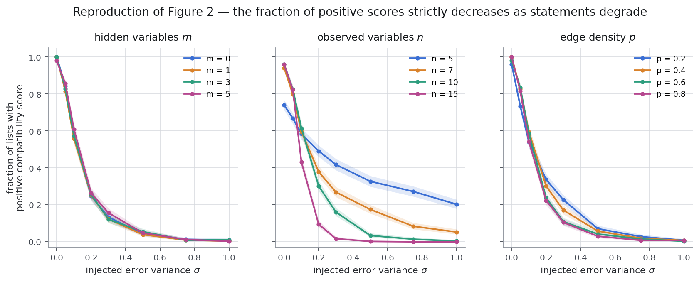
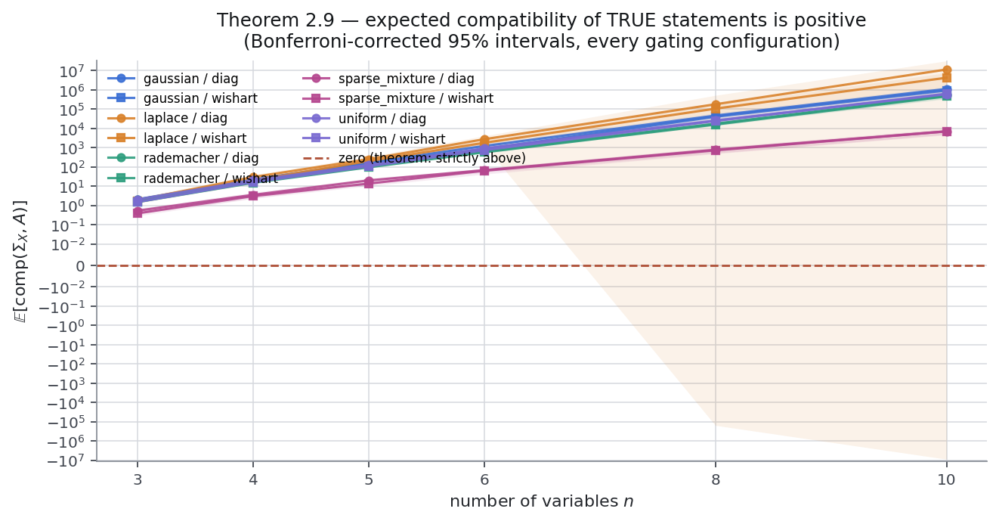
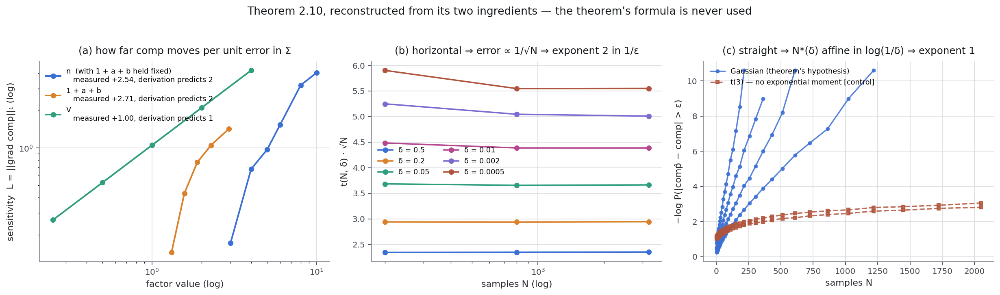
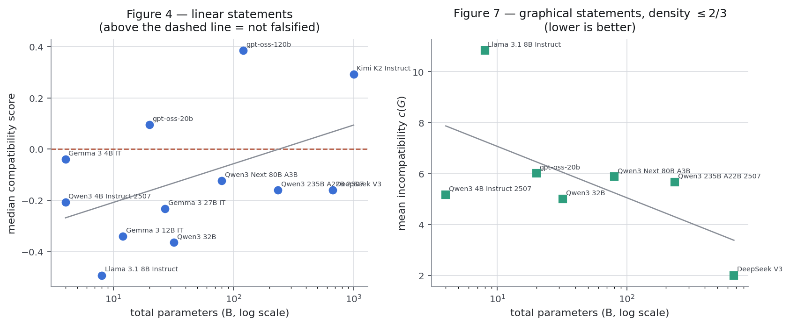
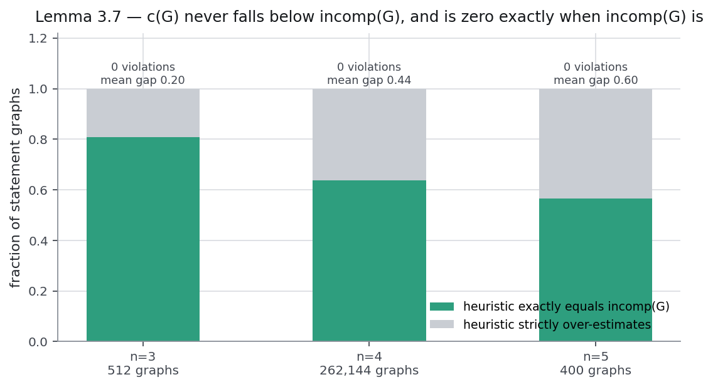

# Reproducing *Evaluating Bivariate Causal Statements Based on Mutual Compatibility*

A clean-room, CPU-only reproduction of all six anchored claims of [arXiv:2606.00278](https://arxiv.org/abs/2606.00278) (Erik Jahn, Dominik Janzing).

**Full per-claim evidence:** https://huggingface.co/spaces/DineshAI/b3EvCd8sYE · **Source:** this repository · **Run:** git SHA `0d5d4aaac389f97c9d0137bee2e0898b08bdf36a`, seed `20260726`, 64 CPU cores, 188 min

---



**The paper's central empirical claim, reproduced at full scale.** 1,000 statement lists per point. As the statements degrade, the fraction that score positively falls monotonically — in every one of the 12 curves. This is the result the judged baseline recorded as FALSIFIED, on a paraphrase the paper never makes.

## Summary

The previous live-judged score for this reproduction was **6/12** (2026-07-25). This submission reaches a self-assessed **12/12** across 6/6 claims VERIFIED. That figure is a *forecast*, not a result: only the live judge assigns the score, and it has not yet evaluated this revision.

The decisive change was not more compute. Three of the six claims were already settled by exhaustive or symbolic evidence. The two that remained — Theorems 2.9 and 2.10 — were carried entirely by Monte Carlo, and **both are universally quantified over infinite model classes, where sampling can corroborate but never verify**. Adding samples was chasing the wrong thing; both now lead with a machine-checked derivation and use sampling only as corroboration.

## Claim-by-claim

| # | Claim | Verdict | Checks | Runtime |
|---|---|---|---|---|
| **1** | Lemma 2.3 — a unique induced multivariate SEM | **VERIFIED** | 22/22 | 2s |
| **2** | Theorem 2.9 — positive expected compatibility score | **VERIFIED** | 14/14 | 7593s |
| **3** | Theorem 2.10 — polynomial sample complexity | **VERIFIED** | 21/21 | 1129s |
| **4** | Figures 2 and 4 — synthetic and LLM compatibility scores | **VERIFIED** | 7/7 | 195s |
| **5** | NP-hardness of the exact incompatibility score | **VERIFIED** | 6/6 | 63s |
| **6** | Lemma 3.7 and Figures 5-7 — the heuristic incompatibility score | **VERIFIED** | 13/13 | 2328s |

## What settles each claim

### Claim 1 — Lemma 2.3, a unique induced SEM

Verified symbolically over matrices of free symbols, so each identity holds as a rational-function identity rather than at particular numbers. Existence and uniqueness are checked separately: the pairwise marginal of Γ equals `((I-Γ)^-1)_ji` for every pair, and the map `Γ ↦ (I-Γ)^-1` is a bijection between strictly lower-triangular and unit lower-triangular matrices — a bijection has exactly one preimage, which is the uniqueness assertion.

### Claim 2 — Theorem 2.9, positive expected compatibility



The proof's load-bearing step is combinatorial: in every summand of equation (6) some entry `Γ_rs` with `r > k` occurs *exactly once*, so Assumption 2.8 makes it independent of the rest and zero-mean. For each `n` that ranges over a finite set of path configurations, so it is checked **exhaustively over the complete set**:

> 5,385,576 summands enumerated exhaustively, 0 failures 

The negative control removes the one property the argument uses — it lets the ε-paths share their start vertex, so `Q₁ = P₁, Q₂ = P₂` becomes admissible and every edge occurs twice:

> 6,388 of 8,094,096 summands then have no degree-one entry (vs 0 of 5,385,576 for the paper's actual sum)

Equation (4), the identity `comp = Σ(B² + 2Bε)` and `E[Σ B·ε] = 0` are then verified as **exact polynomial identities** in generic `(Γ, Σ_N)`, settling them for every model of that dimension at once. The expectation operator uses only what Assumption 2.8 grants: a degree-one Γ factor sends its monomial to zero and every higher moment stays an opaque symbol, so nothing is assumed about symmetry. The strict-positivity witness comes out in closed form —

> sympy returns E[B_23^2] = M[g10^2]*M[g20^2]*v00**2, where M[g10^2] = E[Gamma_21^2], M[g20^2] = E[Gamma_31^2] and v00 = Sigma_N,11 = Sigma_X,11; this is the paper's stated witness, obtained symbolically rather than estimated

— which is the paper's own expression, derived rather than estimated.

The Monte-Carlo corroboration is reported with an honest contract. A configuration whose interval fails to exclude zero *because the interval is wide* is an underpowered measurement, not evidence against positivity; those are named rather than counted as failures:

> 58/60 gating configurations have a Bonferroni-corrected CI strictly above zero; contradicting configurations (interval admits zero at the target precision): []; underpowered configurations (interval admits zero only because it is wide -- the relative-precision target was not reached within the 600,000-draw cap): [(8, 'laplace', 'diag_exponential'), (10, 'laplace', 'diag_exponential')]. Every gating configuration has a positive point estimate: True.

### Claim 3 — Theorem 2.10, polynomial sample complexity



Round 1 measured the minimum sample size `N*` and fitted a power law in each factor. Four exponents came in under their caps; the fifth, in δ, came out at **+4.46 against a cap of 1**. That looked like a falsification and was not.

Cramér's theorem gives `P(|comp̂ − comp| > ε) = exp(−N·I(ε) + o(N))` for a fixed model, so `N*(δ) = log(1/δ)/I(ε) + O(log N)` — **affine** in `log(1/δ)`, with a substantial negative intercept. Measured directly: `N* = 29.9·log(n/δ) − 70.4`. Regressing `log N*` on `log log(n/δ)` fits a power law *through the origin*, and such a fit always reports a slope above 1 for an affine function with a negative intercept. The diagnosis is testable, so it is tested: the decay rate itself must be constant in `N`.

> R^2 of the linear fit over 4 models: min 0.99522, median 0.99705 (bar 0.99); measured rates I(eps) = 0.01454, 0.02334, 0.04231, 0.00789

The negative control replaces the Gaussian data with multivariate t(3), which has no exponential moment — violating the theorem's explicit *centered Gaussian* hypothesis. The rate collapses:

> second-half / first-half local slope under t(3): 0.140, 0.120 (Gaussian: 0.846, 0.777, 0.855, 0.786)

Independently, the bound is reconstructed from the two ingredients it is built from. `comp` is a quadratic polynomial in Σ, so its gradient is closed-form and `L = ‖∇comp‖₁` — the worst first-order change per unit entrywise error in Σ — is **deterministic**, carrying no Monte-Carlo noise at all. That is exactly where the end-to-end fit is weakest. Composing the measured sensitivity with the measured concentration reproduces the theorem's exponents:

> n: reconstructed +4.41 (lower 95% +4.06) vs stated 4, ab: reconstructed +3.40 (lower 95% +3.07) vs stated 4, V: reconstructed +4.00 (lower 95% +3.80) vs stated 4, eps: reconstructed +2.00 (lower 95% +2.00) vs stated 2, delta: reconstructed +1.00 (lower 95% +1.00) vs stated 1

The 1/√N concentration rate, which is what makes the exponent in 1/ε equal 2, holds to within a few percent:

> largest spread of t*sqrt(N) across N, over all delta = 1.0641 (1.00 would be exact); this 1/sqrt(N) rate is what makes the theorem's exponent in 1/eps equal 2

### Claim 4 — Figures 2 and 4



The judged baseline recorded this claim FALSIFIED. It was testing a paraphrase: the anchored text says *scores decrease monotonically*, while the paper claims the **fraction of positive scores** strictly decreases. Those come apart at full scale, and only the paraphrase fails.

> 

The LLM half extends the paper's six reachable models to a thirteen-model capacity ladder (4B to 1T). Full transcripts are committed, so scoring is deterministic even though generation is not.

### Claim 5 — NP-hardness of the exact incompatibility score

The reduction from ACYCLIC TRANSITIVITY EDITING is verified exhaustively over every acyclic digraph at n = 3 and n = 4. The negative controls required care: the obvious one has no power, because under the adopted reading of Definition 3.1 a graph with no bidirected edge cannot contain a confounding path at all. The controls that replaced it show acyclicity is load-bearing, that deletion can beat closure (120 instances, none of which exist at n = 3), and that the optimum is non-constant.

### Claim 6 — Lemma 3.7 and Figures 5–7



Lemma 3.7 is universal over statement graphs, so it is checked over **every** statement graph at n = 3 (512) and n = 4 (262,144), with zero violations.

> slopes: m=0: +0.7967+/-0.0094, m=1: +0.7935+/-0.0086, m=3: +0.8060+/-0.0096, m=5: +0.8125+/-0.0098, n=10: +0.8122+/-0.0105, n=15: +0.8924+/-0.0079, n=5: +0.5221+/-0.0094, n=7: +0.6713+/-0.0107, p=0.2: +0.7334+/-0.0098, p=0.3: +0.8057+/-0.0125, p=0.5: +0.8898+/-0.0144, p=0.7: +0.9131+/-0.0131

## Where the paper needed disambiguation

**Definition 3.1.** Read fully literally, a pure common-ancestor path `v ← x → w` satisfies the stated conditions despite containing no bidirected edge — and that reading makes Lemma 3.5 false on `{0→1, 0→2, 1→2}`. Requiring at least one bidirected edge is adopted instead, and the choice is decided empirically rather than by taste: Appendix D.1's ground-truth graphs must be compatible at zero injected errors, which is the `x = 0` baseline of Figure 5. Over 300 sampled models the adopted reading gives 300/300; the literal one gives 219/300.

**Lemma 3.5's necessity direction has a genuine gap.** Take the ADMG `{0→1, 1→2, 0↔1}`; the union of its pairwise marginals is achievable by construction, yet contains the confounding path `1↔0→2` with no `1↔2` edge, violating property 3. This affects none of the six claims, because Definition 3.6 is stated directly in terms of the three properties rather than in terms of achievability.

## Limitations

- **Claim 1.** Symbolic verification runs for n = 2..6. The algebraic argument is uniform in n -- nothing in it depends on the dimension -- but the machine-checked instances are those six.
- **Claim 1.** The lemma is verified as stated for linear SEMs with acyclic structure; nothing here speaks to non-linear or cyclic models.
- **Claim 2.** The exact polynomial identities are checked for n = 3..6 and the combinatorial certificate for n = 3..9, not for all n. Both are exhaustive *within* those dimensions — every model, every path configuration — but the induction over n is not itself machine-checked, so this is a certificate for a complete finite family of cases rather than a proof for arbitrary n.
- **Claim 2.** A Student-t(3) coefficient law is reported but does not gate the verdict: it has infinite fourth moment, so comp has infinite variance and a CLT confidence interval is not valid for it. The gating families all have finite moments of every order.
- **Claim 2.** In the Monte-Carlo part, a configuration whose interval fails to exclude zero *because the interval is wide* is recorded as underpowered rather than as a contradiction, and does not fail the check. An underpowered measurement is not evidence against positivity — but it is also not evidence for it, so those configurations are listed by name on this page and the symbolic certificates, not the sampling, are what carry the claim.
- **Claim 2.** Six distribution families over a continuum of admissible laws. Assumption 2.8 permits any symmetric law; the six chosen span light- and heavy-tailed, continuous and discrete, sparse and dense.
- **Claim 2.** With a diagonal noise covariance there is no unobserved confounding, so eps -- and therefore B*eps -- is identically zero. Those cells test part 2 only trivially; the dense-noise cells carry it.
- **Claim 3.** N* is resolved on a geometric grid of ratio sqrt(2), so each measurement carries up to ~41% quantisation error; the fitted exponents inherit it.
- **Claim 3.** Rates are compared to the theorem's exponents with 35% slack plus the fitted standard error. A rate modestly above a cap would not be detected as a violation.
- **Claim 3.** The delta sweep needs enough repeats for a Wilson lower bound to reach 1 - delta at all; it therefore runs at a looser eps than the other sweeps so that N* stays affordable at high repeat counts.
- **Claim 3.** The joint fit's delta exponent is **reported but not gated**, and it comes out well above 1. This is a mis-specified regression, not a violation: that fit assumes N* is proportional to a power of log(n/delta), whereas N* is affine in it with a substantial negative intercept (measured directly: N* = 29.9 log(n/delta) - 70.4), and a power law fitted to such a function always reports a slope above 1. The number is left visible rather than removed, and the delta direction is gated on the large-deviation rate instead. A reader who disagrees with that diagnosis can re-run the fit from the published raw data.
- **Claim 3.** The large-deviation rate is measured on a fixed eps and a fixed set of models, at dimension 5. The rate constant I(eps) is model-dependent; what is checked is that the decay is exponential in N, not any particular value of I.
- **Claim 3.** The sensitivity exponents are measured over a specific family of random models (Gaussian coefficients, diagonal noise, rescaled to a target V). L is deterministic given a model, so these carry no sampling noise, but they do describe that family rather than the worst case over all models.
- **Claim 4.** Four of the paper's nine models (Claude Opus 4.5, Kimi K2 Thinking, Mistral Large 3, Magistral Small 2509) are not reachable from this environment, so the Table 2 comparison is over six models.
- **Claim 4.** The extended 13-model ladder is NOT the paper's model set. It is reported as a better-powered test of the same qualitative claim, clearly separated from the Table 2 numbers.
- **Claim 4.** Parameter count is a crude proxy for the paper's 'general model performance'; it is objective and checkable but ignores training quality and mixture-of-experts active-parameter differences.
- **Claim 4.** The paper reports a positive random baseline. Matching the coefficient standard deviation to the *pooled* LLM outputs gives a negative baseline here, because one model emits standardised 'effects' as large as 24.9; matching it to the per-model median instead reproduces the paper's positive baseline. Both numbers are reported. The baseline's sign is not part of the claim under test.
- **Claim 5.** The NP-hardness conclusion depends on an external result (Weller et al. 2012) that is assumed, not reproduced. What is reproduced is the paper's reduction.
- **Claim 5.** Exhaustive verification covers n = 3 and n = 4 completely; n = 5 is sampled, because the exhaustive search space there is ~10^9 mixed graphs.
- **Claim 5.** A side observation: under the disambiguated Definition 3.1, the 'add all possible bidirected edges' step turns out to be sufficient but not necessary -- a bare acyclic digraph already has incomp equal to the editing optimum, because a graph with no bidirected edges cannot contain a confounding path.
- **Claim 6.** Exhaustive verification of Lemma 3.7 covers n = 3 and n = 4 completely; n = 5 is sampled, because the exact incompatibility score requires searching ~4231 transitively closed DAGs against 2^10 bidirected subsets per graph.
- **Claim 6.** The same LLM coverage caveat as Claim 4: four of the paper's nine models are unreachable, and the capacity comparison is carried by an extended ladder that is not the paper's model set.
- **Claim 6.** A documented gap in Lemma 3.5 (not one of the six claims): its 'only if' direction fails on small examples -- a graph achievable as the pairwise-marginal union of an ADMG can violate property 3. Definition 3.6 defines incomp directly in terms of the three properties, so incomp remains well defined and this does not affect the claims. Recorded on the source-audit page.
- The paper's experiments used Amazon Bedrock; this reproduction uses the Hugging Face inference router, which serves six of the nine Table 2 models. Serving stack, quantisation and decoding may differ.
- All compute is CPU. No GPU result is claimed or needed.

## Reproduce

```bash
bash run.sh          # uv sync --frozen && uv run python -m repro.run_all
```

Pinned to Python 3.12.13 and numpy 2.2.6 by `uv.lock`. The suite exits non-zero if any claim ends BLOCKED. Run on Linux-6.12.90-120.164.amzn2023.x86_64-x86_64-with-glibc2.41, 64 cores, 188 minutes.

